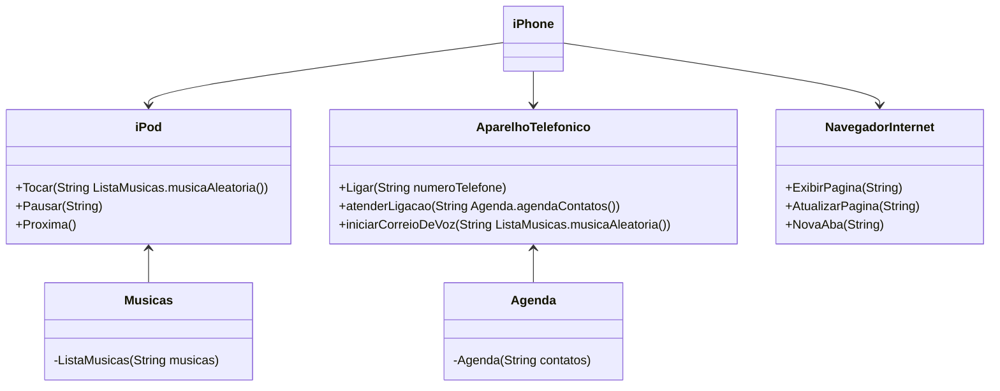

```mermaid
classDiagram

    class iPod {
        +Tocar(String ListaMusicas.musicaAleatoria())
        +Pausar(String)
        +Proxima()
    }

    class AparelhoTelefonico {
        +Ligar(String numeroTelefone)
        +atenderLigacao(String Agenda.agendaContatos())
        +iniciarCorreioDeVoz(String ListaMusicas.musicaAleatoria())
    }

    class NavegadorInternet {
        +ExibirPagina(String)
        +AtualizarPagina(String)
        +NovaAba(String)
    }

    class iPhone {
    }
    class Musicas {
        -ListaMusicas(String musicas)
    }
     class Agenda {
        -Agenda(String contatos)
    }

    iPhone --> iPod
    iPhone --> AparelhoTelefonico
    iPhone --> NavegadorInternet
    iPod <-- Musicas
    AparelhoTelefonico <-- Agenda

```